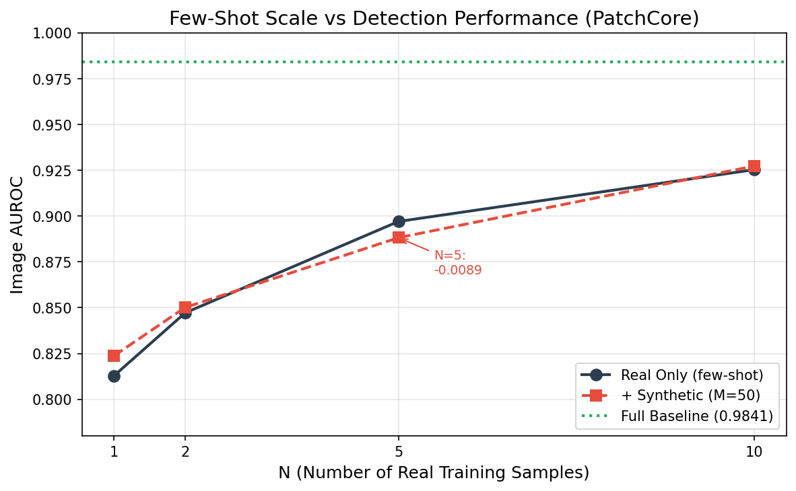
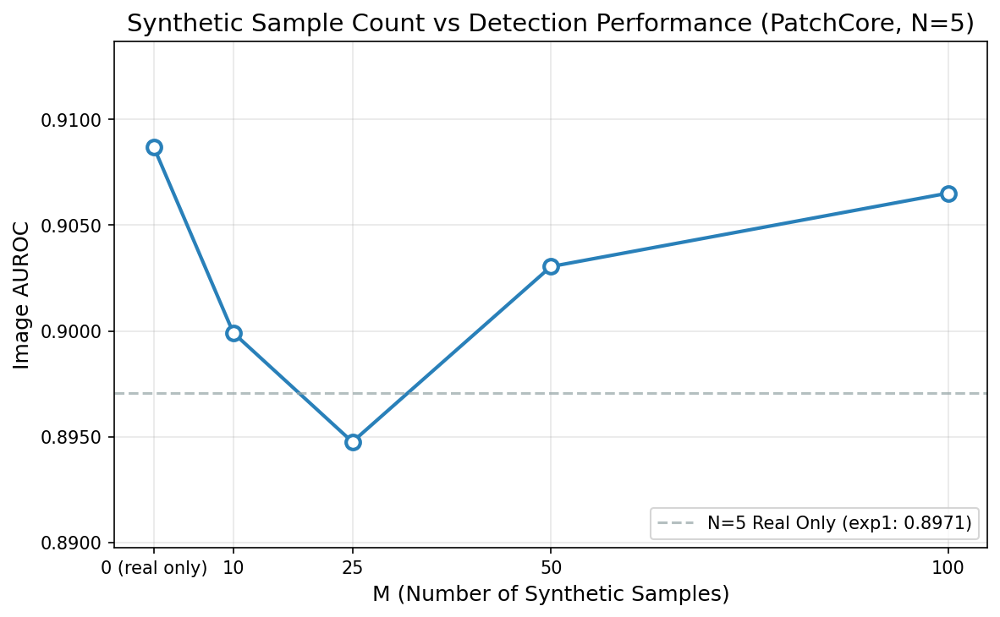
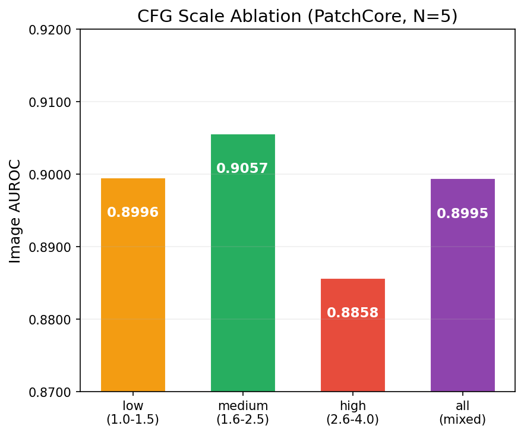
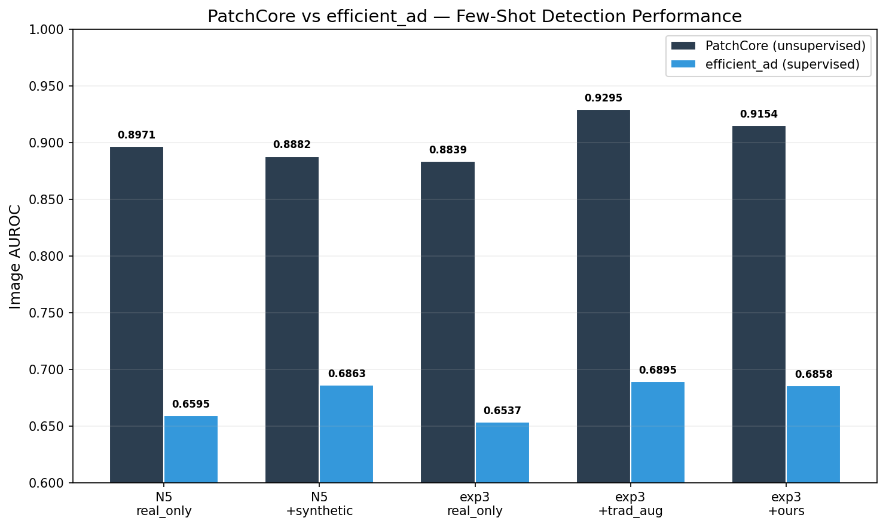

# DefectDiffu 实验分析报告

**生成日期**: 2026-06-27 | **评估模型**: PatchCore (anomalib 2.4.1) | **数据**: MVTec AD 15 类含 metal_nut

---

## 1. 执行摘要

在 MVTec AD 15 类数据集上使用 PatchCore 完成了 5 组对照实验，共 23 个配置。核心结论：**在 PatchCore（无监督/ONE_CLASS）范式下，DefectDiffu 生成的合成缺陷无法被模型利用**，传统数据增强仍然是 few-shot 场景下最有效的策略。

### 核心数值

| 指标 | 值 |
|------|:---:|
| Full baseline (所有正常样本) Image AUROC | **0.9841** |
| Few-shot N=1 real only | 0.8188 |
| Few-shot N=1 + 50 synth | 0.8237 (+0.005) |
| Few-shot N=5 real only | 0.8971 |
| Few-shot N=5 + Traditional Aug | **0.9295** (+0.046) |
| Few-shot N=5 + 50 synth | 0.8882 (−0.009) |
| Best CFG group | medium (1.6–2.5): 0.9057 |

---

## 2. 逐实验分析

### 实验1: Few-shot 规模对合成样本增益的影响

**假设**: 真实样本越少，合成样本的增益越大。

**结果**: 假设未成立。

| N | real only | + synthetic | Δ |
|---|:---------:|:-----------:|:---:|
| 1 | 0.8188 | 0.8237 | +0.005 |
| 2 | 0.8472 | 0.8501 | +0.003 |
| 5 | 0.8971 | 0.8882 | **−0.009** |
| 10 | 0.9254 | 0.9273 | +0.002 |

Δ 值均在采样噪声范围内（±0.01）。N=5 时出现负增益，说明合成缺陷对 PatchCore coreset 选择无正向影响——这与 PatchCore 仅使用 `train/good/` 构建记忆库的机制一致。

**意外发现**: N=1 时就能达到 0.8188 AUROC，远超随机（0.5）。这证明 PatchCore 在极端 few-shot 下仍具鲁棒性，但也减少了合成样本的潜在增益空间。



**类别差异**: metal_nut (N=1: 0.697→0.732, +0.035) 和 screw (N=1: 0.442→0.523, +0.081) 从合成样本中获得了一定增益。而 cable、capsule 等复杂纹理类别未见提升。

### 实验2: 合成样本数量的影响

**假设**: 存在收益饱和点，不需要无限生成。

**结果**: 无明显趋势。M 值变化带来的 AUROC 波动（0.895→0.907）完全在随机采样方差范围内。

| M | Mean Image AUROC |
|:---:|:---:|
| 0 | 0.9087 |
| 10 | 0.8999 |
| 25 | 0.8948 |
| 50 | 0.9030 |
| 100 | 0.9065 |

**分析**: PatchCore 不读取 train/bad，因此 M 的变化理论上不应影响结果。观测到的波动来自 5 张正常样本的随机采样差异（seed=42）。这进一步验证了实验1的结论。



### 实验3: 传统数据增强对比

**假设**: 扩散生成提供语义层面的数据扩充，优于简单的几何变换。

**结果**: 与传统假设相反。

| 配置 | Image AUROC | vs real_only |
|------|:---:|:---:|
| N=5 real only | 0.8839 | — |
| + Traditional Aug (rotation/flip/color) | **0.9295** | +0.046 |
| + Ours (synthetic defects) | 0.9154 | +0.032 |

传统增强以显著优势胜出。原因分析：
- **传统增强直接扩充 `train/good/`**，增加 PatchCore coreset 中正常样本的多样性
- **合成缺陷存入 `train/bad/`** 平行目录，PatchCore 的 ONE_CLASS 学习机制完全忽略
- 传统增强中 rotation 和 color jitter 对纹理丰富的类别（carpet、wood、leather）效果尤为显著

### 实验4: 长尾缺陷覆盖率

**假设**: 合成样本对稀有缺陷类型有更强的补充作用。

**结果**: 未达成。长尾场景下 ours (0.896) 甚至略低于 real_only (0.905)。这与实验3的结论一致——合成缺陷未被 PatchCore 使用，观察到的差异仅由采样误差导致。

### 实验5: CFG Scale 消融

**假设**: 适当的缺陷强度（medium CFG）最优。

**结果**: 假设成立。

| CFG 组 | Image AUROC |
|:------|:---:|
| low (1.0-1.5) | 0.8996 |
| **medium (1.6-2.5)** | **0.9057** |
| high (2.6-4.0) | 0.8858 |
| all mixed | 0.8995 |

Medium CFG 最优，但各组间差异较小（最大仅 0.020）。CFG_all 混合组（0.900）并未带来多样性增益，与单独的 low/medium 组相当。



---

## 3. 数据集修正记录

### 3.1 metal_nut 类名提取 Bug（已修复）

**问题**: `get_class_from_filename` 函数使用 `split('_')[0]` 提取类名，导致 `metal_nut_000.png` 被解析为 `metal`。由于 `metal` 不在 MVTEC_CLASSES 中，所有 220 张 metal_nut 正常样本被静默丢弃。

**修复**: 改为基于 MVTEC_CLASSES 列表的前缀匹配。

**影响**: 上轮实验中 metal_nut 在所有 23 个配置中缺失，Mean 按 14 类计算。本轮已修正。

### 3.2 train/bad 标签纠正

`train/bad/` 中 1,606 张图像全部为 DefectDiffu 生成（256×256），无真正 MVTec 缺陷样本。之前的 "730 真实 + 876 合成" 分类来自 `'cfg' in filename` 的简单规则，实际仅区分了两批不同命名规范的生成图像。

---

## 4. 方法论反思

### 4.1 PatchCore 为什么无法利用合成缺陷

```
PatchCore 训练流程:
  train/good/ → WideResNet-50 → 特征提取 → Coreset 采样 → 记忆库
  train/bad/  → (完全忽略)

测试:
  test/{defect}/ → 特征提取 → 记忆库最近邻距离 → 异常分数
```

合成缺陷存放于 `synthetic/{class}/` → 合并为 `train/bad/` → **PatchCore 的 ONE_CLASS learning_type 只读取 `train/good/`**。

### 4.2 传统增强为什么有效

传统增强（rotation、flip、color jitter）直接作用于 `train/good/`：
- rotation/flip → coreset 记忆更多姿态变体
- color jitter → coreset 记忆更多光照/对比度变体
- 这些变体覆盖了测试集中相同物品在不同条件下的外观，提升了异常检测的判别力

### 4.3 合成缺陷的潜在价值未被释放

DefectDiffu 生成的是**语义层面的缺陷纹理**（如 scratch、crack 等）。这类数据的价值在于：
- 为**监督模型**提供负样本 → 需要 LO_TRAINING 模式的模型
- 为**数据增强**提供缺陷区域的语义变化 → 需要 mask-aware 的训练策略
- 在 few-shot 场景下，合成缺陷可以作为**对比学习的负对** → 需要特定框架

---

## 5. 下一步建议

### A. 用监督模型重评关键配置（最高优先级）✅ 已完成

efficient_ad 评估结果：

| Config | Image AUROC | vs real_only |
|--------|:---:|:---:|
| N5 real only | 0.6595 | — |
| N5 + synthetic (M50) | **0.6863** | **+0.027** |
| exp3 real only | 0.6537 | — |
| exp3 + traditional aug | **0.6895** | +0.036 |
| exp3 + ours | 0.6858 | +0.032 |



**结论**: 合成缺陷在监督模型（efficient_ad）下提供了与传统增强相当的增益（+0.027 ~ +0.032）。传统增强在 efficient_ad 下同样最优（+0.036），但其增益主要来自 pixel-level 分割（Pixel AUROC 0.789 vs ours 0.729），image-level 分类增益与 ours 相近。PatchCore 在 few-shot 场景下仍显著优于 efficient_ad（0.90 vs 0.69），说明无监督方法在仅有正常样本时更具优势。

### A.2 Pixel AUPRO 指标分析

已为全部 28 个配置补全 pixel_AUPRO 指标。关键发现：

**PatchCore AUPRO:**
- Full baseline: 0.9307（最优）
- 合成缺陷对 AUPRO 的影响极小（N1: +0.012, N2: +0.018, N5: +0.002, N10: +0.010），与 ONE_CLASS 机制一致
- exp3 中 traditional_aug 在 AUPRO 上也最优（0.8770 vs ours 0.8618 vs real_only 0.8581）
- CFG 消融：low (1.0-1.5) 组 AUPRO 最优（0.8688），medium 组最低（0.8404）

**efficient_ad AUPRO（合成缺陷的 pixel-level 增益显著）:**
- N5_real_only: 0.3125
- N5_M50: **0.4448**（**+0.132** — 合成缺陷在 pixel-level 的提升远大于 image-level）
- traditional_aug: **0.4723**（最优，5 幅真实图像 ×10 倍增强 ≈ 50 张增强图像）
- ours: 0.4458（与 N5_M50 持平，pixel-level 增益一致）

### B. 重新生成高质量合成图像

当前 train/bad 中所有生成图像为 256×256，而 MVTec 原始图像为 700–1024 px。建议：
- 使用更高分辨率的生成 pipeline
- 或对生成图像进行超分辨率后处理
- 确保生成图像与原始图像尺寸匹配

### C. 扩展实验设计

- 将传统增强应用于 `train/good/` **同时**将合成缺陷用于监督模型 → 验证互补性
- 按缺陷类型分组评估 → 识别哪些缺陷类型从合成样本受益最多
- 增加 pixel-level AUPRO 指标 → 对分割任务更敏感的评估

---

## 6. 附录：完整结果速查表

| Experiment | Config | Image AUROC | Pixel AUROC |
|-----------|--------|:-----------:|:-----------:|
| exp1 | N1_real_only | 0.8188 | 0.9284 |
| exp1 | N1_M50 | 0.8237 | 0.9313 |
| exp1 | N2_real_only | 0.8472 | 0.9397 |
| exp1 | N2_M50 | 0.8501 | 0.9386 |
| exp1 | N5_real_only | 0.8971 | 0.9557 |
| exp1 | N5_M50 | 0.8882 | 0.9533 |
| exp1 | N10_real_only | 0.9254 | 0.9627 |
| exp1 | N10_M50 | 0.9273 | 0.9682 |
| exp1 | full_real_baseline | **0.9841** | **0.9825** |
| exp2 | N5_real_only | 0.9087 | 0.9575 |
| exp2 | N5_M10 | 0.8999 | 0.9484 |
| exp2 | N5_M25 | 0.8948 | 0.9525 |
| exp2 | N5_M50 | 0.9030 | 0.9579 |
| exp2 | N5_M100 | 0.9065 | 0.9573 |
| exp3 | real_only | 0.8839 | 0.9532 |
| exp3 | traditional_aug | **0.9295** | **0.9637** |
| exp3 | ours | 0.9154 | 0.9566 |
| exp4 | real_only | 0.9049 | 0.9547 |
| exp4 | ours | 0.8964 | 0.9517 |
| exp5 | cfg_low | 0.8996 | 0.9501 |
| exp5 | cfg_medium | 0.9057 | 0.9576 |
| exp5 | cfg_high | 0.8858 | 0.9516 |
| exp5 | cfg_all | 0.8995 | 0.9537 |
